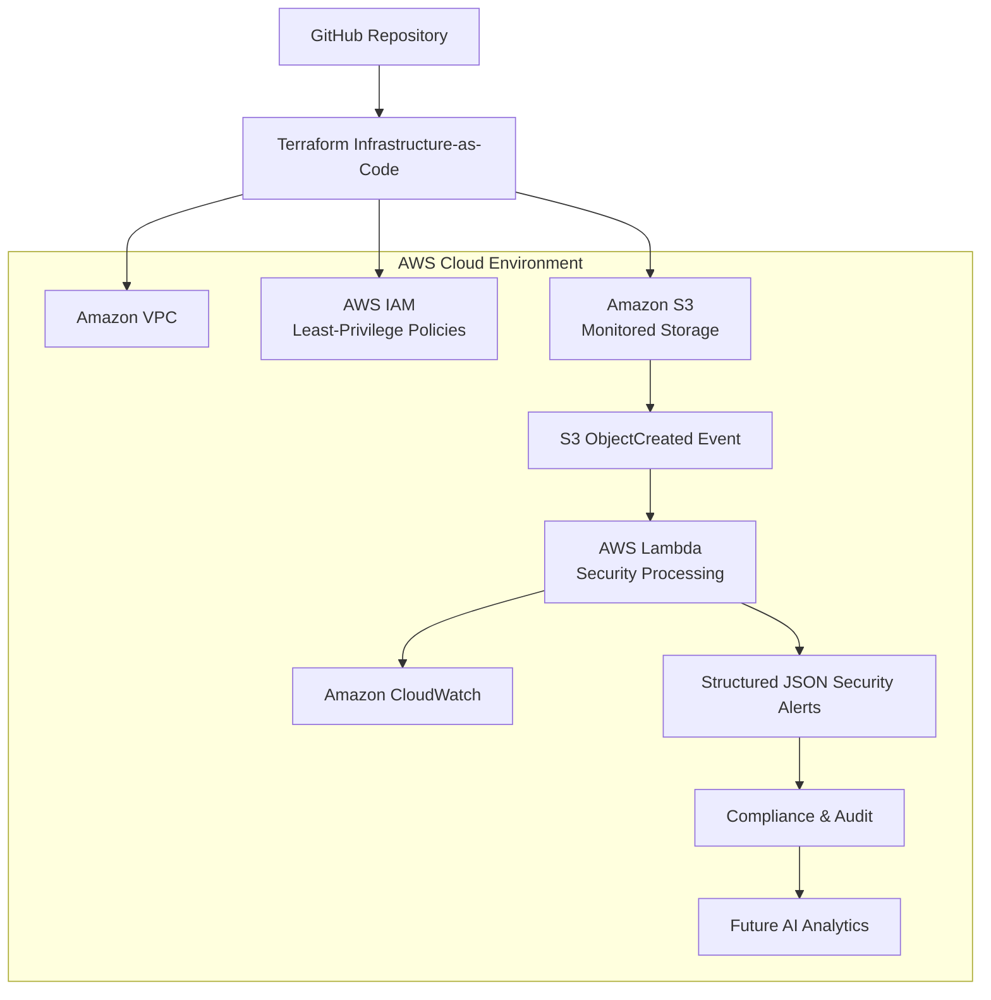

# Autonomous Zero Trust Cloud Security Framework for AWS

### Advancing Secure Cloud Infrastructure Through Infrastructure-as-Code, Event-Driven Monitoring, and Security Automation


---

# Executive Summary

Cloud adoption has transformed the way organizations deploy, manage, and secure digital infrastructure. While cloud platforms provide scalability and operational efficiency, they also introduce security challenges such as storage misconfigurations, excessive identity permissions, and delayed threat detection. These issues remain among the leading causes of cloud security incidents across government agencies, healthcare organizations, financial institutions, educational institutions, and other sectors that depend on cloud-native technologies.

The **Autonomous Zero Trust Cloud Security Framework** demonstrates how **Infrastructure-as-Code (Terraform)**, **Zero Trust Architecture**, **event-driven monitoring**, and **security automation** can be integrated to provision secure cloud infrastructure, continuously monitor cloud activity, and generate structured security telemetry that supports governance, compliance, and incident response.

Rather than relying on manual configuration reviews or traditional perimeter-based security models, the framework provisions cloud infrastructure through code, applies least-privilege security controls, automatically detects cloud storage events, and generates machine-readable security records suitable for auditing and future intelligent threat analysis.

This repository represents the technical implementation of my proposed endeavor to advance cloud security through secure infrastructure automation, Zero Trust engineering, and continuous security monitoring.

---

# 🚀 Quick Start

```bash
git clone https://github.com/TaiwoGlobalCloud/autonomous-zero-trust-cloud-security.git

cd autonomous-zero-trust-cloud-security

terraform init

terraform validate

terraform plan

terraform apply
```

For detailed deployment instructions, see the Deployment Guide below.

---

# Why This Matters

Cloud security incidents continue to increase as organizations migrate critical workloads to public cloud platforms. Security reports consistently identify cloud misconfigurations, excessive permissions, and inadequate monitoring as major contributors to cloud data exposure and operational risk.

Traditional security approaches often depend on manual configuration reviews, periodic compliance assessments, and reactive incident response. These methods can delay the detection of security events and increase the likelihood of configuration errors.

This framework demonstrates a practical approach for addressing these challenges by combining Infrastructure-as-Code, Zero Trust principles, and event-driven automation to:

- Automate secure cloud infrastructure deployment
- Reduce cloud misconfiguration risks
- Enforce least-privilege access controls
- Improve cloud visibility through continuous monitoring
- Generate structured security evidence for auditing and compliance
- Provide a scalable foundation for AI-assisted cloud security analytics

The long-term vision is to contribute to more resilient cloud environments through autonomous security capabilities that reduce manual effort while improving governance and operational security.

---

# Proposed Endeavor

This repository documents the technical implementation of an **Autonomous Zero Trust Cloud Security Framework** designed to advance secure cloud infrastructure through **Infrastructure-as-Code (IaC)**, **Zero Trust Architecture (ZTA)**, **event-driven monitoring**, and **security automation**.

The project addresses persistent cloud security challenges such as infrastructure misconfigurations, excessive identity permissions, limited operational visibility, and delayed threat detection by demonstrating a repeatable, automated security framework that can be deployed using Infrastructure-as-Code.

The long-term vision of this endeavor is to develop scalable cloud security solutions that help organizations strengthen governance, reduce manual security operations, improve continuous compliance, and enhance cyber resilience across cloud-native environments.

As the project evolves, additional capabilities such as AI-assisted anomaly detection, automated policy enforcement, intelligent risk analysis, and autonomous remediation can be incorporated to further improve cloud security operations.

---

# Project Vision

The vision of this project is to demonstrate how cloud security can move beyond traditional reactive defenses toward autonomous, policy-driven security architectures that continuously verify, monitor, and protect cloud resources.

Rather than treating security as an activity performed after infrastructure deployment, this framework integrates security directly into the cloud provisioning lifecycle, enabling organizations to build secure environments from the beginning while continuously monitoring operational events.

The framework is designed around four engineering principles:

- Secure-by-Design Infrastructure
- Zero Trust Security
- Infrastructure Automation
- Continuous Security Monitoring

---

# Technical Innovation

This project combines several modern cloud engineering practices into a unified security framework.

Key technical innovations include:

- Infrastructure provisioning using Terraform
- Zero Trust-inspired security architecture
- Event-driven monitoring using Amazon S3 and AWS Lambda
- Automated generation of structured security telemetry
- Least-privilege Identity and Access Management (IAM)
- Infrastructure versioning through Git and GitHub
- Modular architecture designed for future AI integration
- Reproducible cloud deployments through Infrastructure-as-Code

The modular design allows additional security services and automation capabilities to be integrated without significantly changing the overall architecture.

---

# Project Objectives

The primary objectives of this framework are to:

- Demonstrate practical implementation of Zero Trust Architecture in AWS.
- Provision secure cloud infrastructure using Infrastructure-as-Code.
- Reduce cloud misconfiguration risks through automated deployment.
- Enforce least-privilege identity and access management.
- Detect cloud storage events using serverless event processing.
- Generate structured security alerts for auditing and compliance.
- Improve visibility into cloud activity.
- Provide a reusable framework for cloud security research and engineering.
- Establish a foundation for future AI-assisted cloud security capabilities.

---

# Key Features

## Infrastructure Automation

- Infrastructure-as-Code using Terraform
- Automated deployment of AWS resources
- Version-controlled cloud infrastructure
- Repeatable infrastructure provisioning

## Identity Security

- Least-Privilege IAM policies
- Role-based access control
- Controlled service permissions

## Network Security

- Amazon VPC deployment
- Private networking architecture
- Reduced attack surface
- Optional VPC endpoints

## Event Monitoring

- Amazon S3 ObjectCreated event notifications
- AWS Lambda event processing
- CloudWatch logging
- Automated security event collection

## Audit & Compliance

- Structured JSON security alerts
- Compliance-oriented logging
- Security telemetry generation
- Foundation for governance reporting

## Future Enhancements

The architecture has been intentionally designed to support future enhancements, including:

- AI-assisted anomaly detection
- Policy-as-Code validation
- Automated security remediation
- Amazon GuardDuty integration
- AWS Security Hub integration
- Multi-account AWS Organizations
- Multi-cloud security support
- Real-time security dashboards
---

# 🏗️ Architecture Overview

The framework follows a **Zero Trust, event-driven cloud security architecture** in which infrastructure is provisioned using **Terraform**, cloud storage events trigger automated processing through **AWS Lambda**, and structured security telemetry is generated to support auditing, compliance, and future AI-assisted analytics.

The architecture emphasizes secure-by-design infrastructure, least-privilege identity management, continuous monitoring, and infrastructure reproducibility.



> **Note**
>
> The current implementation demonstrates secure infrastructure provisioning, event-driven monitoring, and structured security telemetry generation. Components labeled **Future AI Analytics** represent planned enhancements and are not part of the current implementation.

---

# 🔄 System Workflow

The framework follows an automated workflow designed to reduce manual security operations while improving visibility into cloud activity.

### Step 1 — Infrastructure Provisioning

Infrastructure is provisioned using **Terraform**, enabling consistent, repeatable deployment of AWS networking, identity, storage, and monitoring resources.

Provisioned resources include:

- Amazon VPC
- IAM Roles & Policies
- Amazon S3
- AWS Lambda
- Event Notifications
- CloudWatch Logging

---

### Step 2 — Secure Storage Event

A user or application uploads an object into the monitored Amazon S3 bucket.

The upload generates an **ObjectCreated** event.

---

### Step 3 — Event Detection

Amazon S3 automatically invokes the AWS Lambda function.

The Lambda function extracts security metadata from the event.

Examples include:

- Event Type
- Bucket Name
- Object Key
- Timestamp
- Request ID
- Source IP (when available)

---

### Step 4 — Security Processing

The Lambda function validates the event and creates a structured JSON security record.

The generated security telemetry can support:

- Operational monitoring
- Compliance reporting
- Security investigations
- Future anomaly detection

---

### Step 5 — Audit & Monitoring

CloudWatch records Lambda execution logs while structured JSON alerts provide machine-readable security evidence suitable for governance and forensic review.

---

### Step 6 — Future Intelligent Analytics

The modular architecture supports future integration with:

- AI-assisted anomaly detection
- Automated policy evaluation
- Risk scoring
- Security recommendations
- Automated remediation workflows

---

# 🧰 Technology Stack

| Category | Technology |
|------------|------------|
| Cloud Platform | Amazon Web Services (AWS) |
| Infrastructure as Code | Terraform |
| Programming Language | Python |
| Compute | AWS Lambda |
| Object Storage | Amazon S3 |
| Identity Management | AWS IAM |
| Networking | Amazon VPC |
| Monitoring | Amazon CloudWatch |
| Version Control | Git |
| Repository | GitHub |
| Security Model | Zero Trust Architecture |
| Event Processing | Amazon S3 Event Notifications |

---

# 📂 Repository Structure

```text
autonomous-zero-trust-cloud-security/
│
├── README.md
├── LICENSE
├── ARCHITECTURE.md
├── deploy.sh
├── .gitignore
│
├── docs/
│   ├── architecture/
│   ├── screenshots/
│   └── validation/
│
└── zero-trust-cloud-security/
    │
    ├── terraform/
    │   ├── main.tf
    │   ├── variables.tf
    │   ├── outputs.tf
    │   ├── provider.tf
    │   ├── networking/
    │   ├── iam/
    │   ├── lambda/
    │   ├── s3/
    │   └── endpoints/
    │
    ├── lambda_function/
    │   └── lambda_function.py
    │
    ├── ai/
    │   └── Future AI anomaly detection components
    │
    └── compliance/
        └── Compliance validation components
```

---

# 📁 Directory Overview

### terraform/

Contains the Infrastructure-as-Code configuration responsible for provisioning AWS resources including networking, identity, storage, serverless processing, and supporting infrastructure.

---

### lambda_function/

Contains the Python-based AWS Lambda function responsible for processing Amazon S3 events and generating structured security alerts.

---

### ai/

Reserved for future AI-assisted cloud security capabilities, including anomaly detection, intelligent event classification, and behavioral analytics.

---

### compliance/

Reserved for future compliance automation, policy validation, governance reporting, and security assessment modules.

---

### docs/

Contains project documentation, architecture diagrams, deployment screenshots, and validation artifacts supporting the implementation.

---

# 🔐 Security Controls

The framework incorporates multiple security controls that align with Zero Trust principles and cloud security best practices. These controls are implemented to improve infrastructure security, reduce configuration risks, and support governance and compliance activities.

| Security Domain | Control | Purpose |
|-----------------|---------|---------|
| Identity | Least-Privilege IAM | Restricts permissions to only those required by each workload. |
| Infrastructure | Infrastructure-as-Code | Ensures repeatable, version-controlled infrastructure deployment. |
| Networking | Amazon VPC | Provides logical network isolation for cloud resources. |
| Monitoring | AWS Lambda | Processes cloud storage events automatically. |
| Logging | Amazon CloudWatch | Captures operational logs for monitoring and troubleshooting. |
| Storage | Amazon S3 | Stores monitored objects and generated security alerts. |
| Audit | Structured JSON Alerts | Produces machine-readable security telemetry for analysis and governance. |
| Automation | Event Notifications | Enables automatic processing of cloud storage events. |

---

# 🛡 Zero Trust Design Principles

The framework is designed around widely recognized Zero Trust concepts that emphasize continuous verification, least privilege, and secure-by-design infrastructure.

## Verify Explicitly

Access decisions should be based on identity, context, and defined security policies rather than implicit trust.

Implementation examples:

- Least-Privilege IAM policies
- Infrastructure version control
- Controlled resource provisioning

---

## Assume Breach

The framework assumes that security events can occur at any time and continuously records cloud storage activity for auditing and operational awareness.

Implementation examples:

- Event-driven monitoring
- Structured security telemetry
- CloudWatch operational logging

---

## Minimize Attack Surface

Infrastructure components are deployed using controlled configurations that reduce unnecessary exposure.

Implementation examples:

- Private VPC architecture
- Controlled IAM permissions
- Infrastructure-as-Code deployment

---

## Automate Security

Security controls are integrated into the deployment and monitoring workflow to reduce manual configuration effort.

Implementation examples:

- Terraform automation
- AWS Lambda event processing
- Automated security alert generation

---

# ⚠ Threat Model

The framework is intended to help organizations improve visibility into cloud activity and reduce operational risks associated with cloud infrastructure.

Examples of cloud security concerns addressed by the framework include:

| Threat | Framework Response |
|---------|--------------------|
| Cloud storage misconfiguration | Infrastructure-as-Code encourages consistent deployment practices. |
| Excessive IAM permissions | Least-Privilege IAM policies reduce unnecessary access. |
| Delayed event visibility | Event-driven Lambda processing provides near real-time monitoring. |
| Limited audit evidence | JSON security alerts create structured security telemetry. |
| Manual deployment errors | Terraform improves deployment consistency and repeatability. |

> **Note:** This framework is intended to improve cloud security operations and visibility. It does not guarantee prevention of all security incidents.

---

# 📊 Validation

...

✔ Terraform infrastructure initialization

✔ Infrastructure validation

✔ Cloud resource provisioning

✔ Amazon S3 event generation

✔ AWS Lambda invocation

✔ Security metadata extraction

✔ JSON alert creation

✔ CloudWatch log generation

----------------------------------------------------

# 📸 Deployment & Validation Screenshots   ← INSERT HERE

(Your five screenshots)

----------------------------------------------------

# 📝 Example Security Alert

{
  JSON Example
}

---

# 📝 Example Security Alert

The Lambda function generates structured JSON security telemetry similar to the following:

```json
{
  "eventType": "ObjectCreated:Put",
  "bucket": "secure-storage",
  "objectKey": "incoming/document.pdf",
  "timestamp": "2026-07-16T18:45:30Z",
  "requestId": "123abc456xyz",
  "sourceIP": "192.168.x.x"
}
```

The JSON structure is designed to support:

- Operational monitoring
- Compliance reporting
- Security investigations
- Future AI-assisted analytics

---

# 📸 Deployment & Validation Screenshots

The following screenshots demonstrate the successful implementation, validation, and testing of the Autonomous Zero Trust Cloud Security Framework.

---

## 1. Terraform Configuration

The project uses Terraform to provision AWS infrastructure using Infrastructure-as-Code (IaC).


---

## 2. Terraform Deployment Plan

Terraform successfully validated the infrastructure configuration and generated an execution plan prior to deployment.


---

## 3. AWS Lambda Functions

AWS Lambda provides autonomous event-driven monitoring by processing Amazon S3 events and generating structured security telemetry.


---

## 4. Amazon CloudWatch Monitoring

CloudWatch captures Lambda execution logs, providing operational visibility into event processing.


---

## 5. Generated Amazon S3 Security Alerts

Security alerts are automatically generated and stored in Amazon S3 for auditing, compliance, and future analytics.


---

# 📈 Performance Considerations

The current implementation is intended to demonstrate the framework architecture and automated security workflow rather than benchmark production-scale performance.

Future evaluations may include:

- Event processing latency
- Infrastructure deployment time
- Lambda execution duration
- Alert generation throughput
- Scalability across multiple AWS accounts
- AI-assisted detection accuracy

---

# 🚀 Deployment Guide

## Prerequisites

Before deploying the framework, ensure the following tools are installed:

- AWS CLI
- Terraform (v1.5 or later recommended)
- Python 3.x
- Git
- An AWS account with appropriate permissions

Verify your AWS credentials:

```bash
aws configure
aws sts get-caller-identity
```

---

## Clone the Repository

```bash
git clone https://github.com/TaiwoGlobalCloud/autonomous-zero-trust-cloud-security.git

cd autonomous-zero-trust-cloud-security
```

---

## Initialize Terraform

```bash
terraform init
```

---

## Validate the Configuration

```bash
terraform validate
```

---

## Review the Deployment Plan

```bash
terraform plan
```

---

## Deploy Infrastructure

```bash
terraform apply
```

Terraform provisions the cloud resources required by the framework.

---

# 🧪 Testing

After deployment, validate the implementation by completing the following steps.

### Test 1 — Infrastructure Deployment

Verify that:

- Amazon VPC exists
- IAM roles were created
- Amazon S3 bucket was provisioned
- AWS Lambda function exists

---

### Test 2 — Event Processing

Upload a test file into the monitored Amazon S3 bucket.

Example:

```
incoming/test-file.txt
```

Expected result:

- Amazon S3 generates an ObjectCreated event.
- AWS Lambda executes automatically.
- CloudWatch logs the execution.
- A JSON security alert is generated.

---

### Test 3 — CloudWatch Validation

Confirm that Lambda execution logs appear in Amazon CloudWatch.

Verify:

- Successful invocation
- Event processing
- Security metadata extraction
- No runtime errors

---

### Test 4 — Security Alert Validation

Verify that the generated JSON security record contains fields such as:

- Event Type
- Bucket Name
- Object Key
- Timestamp
- Request ID

---

# 📈 Future Roadmap

The framework has been intentionally designed for future expansion.

Planned enhancements include:

### Artificial Intelligence

- AI-assisted anomaly detection
- Behavioral analytics
- Intelligent event classification
- Risk scoring

---

### Cloud Security

- Amazon GuardDuty integration
- AWS Security Hub integration
- AWS Config integration
- CloudTrail event correlation

---

### Compliance

- Automated compliance reporting
- Policy-as-Code validation
- Security posture assessment
- Governance dashboards

---

### Automation

- Automated incident response
- Automated remediation
- Infrastructure drift detection
- Multi-account deployment

---

### Multi-Cloud Support

Future versions may support:

- Microsoft Azure
- Google Cloud Platform (GCP)
- Hybrid cloud environments

---

# 📚 Research Alignment

This repository complements my ongoing research in:

- Zero Trust Architecture
- Infrastructure-as-Code
- Cloud Security Automation
- Cloud Governance
- Continuous Compliance
- AI-assisted Cloud Security

The implementation demonstrates how cloud security concepts discussed in my research can be translated into practical, reproducible engineering solutions using Infrastructure-as-Code and event-driven cloud services.

---

# 🌍 Potential Applications

The framework is designed to support organizations operating cloud workloads in sectors such as:

- Government
- Healthcare
- Financial Services
- Higher Education
- Energy
- Critical Infrastructure
- Technology

Potential applications include:

- Cloud governance
- Security monitoring
- Compliance support
- Security operations
- Cloud engineering education
- Security research

---

# 🤝 Contributing

Contributions that improve the framework, documentation, testing, or security capabilities are welcome.

Examples include:

- Bug fixes
- Documentation improvements
- Infrastructure enhancements
- Security feature additions
- Testing improvements
- AI-assisted analytics modules

Please submit a Pull Request or open an Issue to discuss proposed improvements.

---

# 📜 License

This project is licensed under the MIT License.

See the `LICENSE` file for additional information.

---

# 📖 Citation

If you reference this project in academic work, research, presentations, or technical publications, please cite the repository appropriately.

Example:

```text
Taiwo Justice Olorunlana.
Autonomous Zero Trust Cloud Security Framework for AWS.
GitHub Repository.
https://github.com/TaiwoGlobalCloud/autonomous-zero-trust-cloud-security
```

---

# 👤 Author

## Taiwo Justice Olorunlana

Cloud Security Engineer | Infrastructure-as-Code | Zero Trust Architecture | AWS | Security Automation | Cloud Governance

### Areas of Interest

- Cloud Security Engineering
- Infrastructure-as-Code
- Zero Trust Architecture
- Cloud Governance
- Security Automation
- AI-assisted Cloud Security
- Cloud Compliance
- DevSecOps

---

# 📬 Contact

For collaboration, research, or technical discussions:

- GitHub: https://github.com/TaiwoGlobalCloud
- LinkedIn: *(Add your LinkedIn profile URL)*
- ORCID: *(Add your ORCID profile URL if desired)*

---

# ⭐ Acknowledgments

This project reflects ongoing work to explore secure cloud infrastructure through Zero Trust engineering, Infrastructure-as-Code, and cloud security automation.

It is intended to serve as both a practical engineering implementation and a foundation for future research into autonomous cloud security architectures.

---

# 🌎 National Importance

Cloud computing has become foundational to modern digital infrastructure, supporting essential services across government, healthcare, financial services, education, energy, manufacturing, telecommunications, and critical infrastructure. As organizations continue migrating mission-critical workloads to cloud environments, the security of cloud infrastructure has become increasingly important to operational resilience and cybersecurity.

Industry reports consistently identify cloud misconfigurations, excessive identity permissions, and inconsistent infrastructure deployment as common contributors to cloud security incidents. These challenges are often exacerbated by manual configuration processes, fragmented security operations, and limited visibility into cloud activity.

This project addresses these technical challenges by demonstrating an automated cloud security framework that combines Infrastructure-as-Code, Zero Trust Architecture, and event-driven monitoring to improve cloud governance, reduce deployment inconsistencies, and strengthen continuous security operations.

Although the current implementation focuses on Amazon Web Services (AWS), the architectural principles demonstrated by the framework are applicable to broader cloud-native security engineering practices.

---

# 🎯 Proposed Impact

The long-term objective of this endeavor is to contribute to the development of cloud security architectures that improve the automation, consistency, and resilience of cloud infrastructure.

The framework is designed to support organizations seeking to:

- Improve cloud security posture through secure-by-design infrastructure.
- Reduce risks associated with manual cloud configuration.
- Strengthen Zero Trust implementation.
- Improve operational visibility through automated monitoring.
- Support continuous compliance and governance.
- Generate structured security telemetry for security operations.
- Provide a foundation for future intelligent security automation.

As the project evolves, additional capabilities may include AI-assisted anomaly detection, automated policy evaluation, intelligent risk scoring, and autonomous remediation workflows.

---

# 💡 Engineering Philosophy

The framework is guided by the principle that cloud security should be integrated directly into infrastructure deployment rather than applied only after systems have been provisioned.

Accordingly, the project emphasizes:

- Security by Design
- Infrastructure as Code
- Least-Privilege Access
- Continuous Verification
- Automation First
- Defense in Depth
- Repeatable Infrastructure
- Continuous Improvement

These principles collectively support a practical implementation of Zero Trust concepts within cloud-native environments.

---

# ⭐ Key Contributions

This repository demonstrates the following engineering contributions:

- Implementation of a reproducible Infrastructure-as-Code security framework using Terraform.
- Practical application of Zero Trust principles within AWS cloud infrastructure.
- Automated event-driven monitoring using Amazon S3 and AWS Lambda.
- Generation of structured JSON security telemetry for operational monitoring and compliance.
- Integration of least-privilege IAM controls into cloud infrastructure deployment.
- Modular architecture supporting future expansion through AI-assisted security capabilities.
- Reusable cloud security engineering practices that promote automation, consistency, and governance.

---

# 🔬 Technical Scope

The current implementation demonstrates the following capabilities:

✔ Secure cloud infrastructure provisioning

✔ Zero Trust-inspired architecture

✔ Event-driven security monitoring

✔ AWS Lambda processing

✔ Least-Privilege IAM implementation

✔ CloudWatch operational logging

✔ Structured JSON security alerts

✔ Infrastructure version control

✔ Automated deployment using Terraform

The project has been intentionally designed to support future enhancements while maintaining a modular and extensible architecture.

---

# 📚 Research Foundation

The Autonomous Zero Trust Cloud Security Framework was developed to explore practical approaches for improving cloud security through Infrastructure-as-Code, Zero Trust Architecture, and security automation.

The framework translates established cloud security concepts into an engineering implementation that demonstrates how secure infrastructure can be provisioned, monitored, and managed using repeatable, code-driven processes.

Rather than relying solely on manual configuration reviews or traditional perimeter-based defenses, the framework integrates infrastructure provisioning, event monitoring, and security telemetry generation into a unified workflow.

The project also serves as a technical platform for continued research into cloud governance, intelligent security automation, and AI-assisted cloud security.

---

# 🛡 Alignment with Zero Trust Principles

Zero Trust is based on the assumption that trust should never be implicit and that every access request should be evaluated according to defined security policies.

The framework has been designed around several widely recognized Zero Trust concepts, including:

### Verify Explicitly

Infrastructure components are deployed using Infrastructure-as-Code, enabling consistent configuration and reducing deployment variability.

Examples include:

- Terraform-managed infrastructure
- Controlled IAM policies
- Version-controlled deployment

---

### Least Privilege

Permissions are limited to the minimum level required for workloads to perform their intended functions.

Examples include:

- IAM Roles
- IAM Policies
- Restricted S3 access
- Controlled Lambda permissions

---

### Assume Breach

Cloud activity is continuously monitored through event-driven processing rather than assuming trusted network boundaries.

Examples include:

- Amazon S3 Event Notifications
- AWS Lambda monitoring
- CloudWatch logging
- JSON security alerts

---

### Continuous Verification

Security events are automatically processed to improve operational visibility and support auditing activities.

Examples include:

- Event-driven monitoring
- Structured telemetry
- Audit logging

---

# ⚙ Infrastructure-as-Code Methodology

Infrastructure-as-Code (IaC) enables cloud infrastructure to be defined, deployed, and maintained using version-controlled source code.

Within this framework, Terraform is used to provision cloud infrastructure in a repeatable and consistent manner.

Benefits include:

- Repeatable deployments
- Reduced configuration drift
- Version-controlled infrastructure
- Easier peer review
- Automated provisioning
- Improved governance

The modular Terraform structure also enables future expansion without requiring significant architectural redesign.

---

# 🔄 Why Terraform?

Terraform was selected because it provides a declarative approach to infrastructure provisioning that supports consistency, automation, and maintainability.

Key advantages include:

- Infrastructure version control
- Reusable modules
- Cloud resource automation
- Repeatable deployments
- Infrastructure consistency
- Multi-cloud extensibility

---

# ⚡ Why Event-Driven Monitoring?

Traditional monitoring approaches often rely on scheduled scans or manual reviews.

This framework instead demonstrates an event-driven model in which cloud storage events automatically invoke monitoring functions.

Advantages include:

- Faster event visibility
- Reduced manual intervention
- Automated processing
- Structured security telemetry
- Improved operational awareness

The event-driven design also provides a foundation for future intelligent security analytics.

---

# 🔑 Why Least-Privilege Access?

Identity security is a fundamental component of Zero Trust Architecture.

The framework applies least-privilege principles by assigning only the permissions required for individual cloud resources to perform their intended functions.

Examples include:

- Dedicated IAM roles
- Service-specific permissions
- Restricted S3 bucket policies
- Controlled Lambda execution roles

Reducing unnecessary permissions helps limit the potential impact of credential misuse while improving governance.

---

# 🔍 Cloud Security Lifecycle

The framework follows a continuous cloud security lifecycle.

```text
Plan
   │
   ▼
Provision Infrastructure
   │
   ▼
Deploy Security Controls
   │
   ▼
Monitor Events
   │
   ▼
Generate Security Telemetry
   │
   ▼
Audit & Compliance
   │
   ▼
Continuous Improvement
```

Each stage contributes to maintaining visibility into cloud operations while supporting repeatable deployment and operational consistency.

---

# 🏛 Design Decisions

Several architectural decisions were made to improve modularity, maintainability, and extensibility.

| Decision | Rationale |
|----------|-----------|
| Terraform | Repeatable Infrastructure-as-Code deployment |
| AWS Lambda | Serverless event processing |
| Amazon S3 | Event source and secure alert storage |
| IAM Roles | Least-Privilege identity management |
| CloudWatch | Operational visibility and runtime logging |
| JSON Alerts | Structured machine-readable security telemetry |
| GitHub | Version control and collaborative development |

These decisions collectively support a modular architecture that can evolve as additional cloud security capabilities are introduced.

---

# 🎓 Educational & Research Value

Beyond its implementation as a cloud security engineering project, the framework also provides value as a learning and research platform.

Potential applications include:

- Cloud security education
- Zero Trust demonstrations
- Infrastructure-as-Code training
- Security automation research
- Cloud governance studies
- DevSecOps experimentation
- Graduate-level cloud computing coursework

The modular architecture allows future researchers and practitioners to extend the framework while preserving its core security design principles.

## 📖 Additional Documentation

For a detailed explanation of the framework architecture, security design, and engineering decisions, see:

- 📘 [Architecture Documentation](ARCHITECTURE.md)
- 🔐 [Security Policy](SECURITY.md)
- 📝 [Changelog](CHANGELOG.md)
- 🤝 [Contributing Guide](CONTRIBUTING.md)

